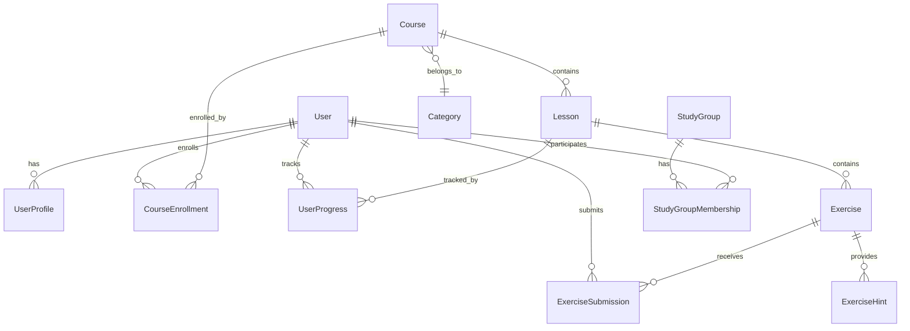

# Current Technical Architecture - Python Learning Studio

## Overview

Python Learning Studio is implemented as a Django-based web application with integrated Wagtail CMS and AI-powered content generation. This document describes the current architecture as implemented and operational.

**Last Updated**: July 5, 2025  
**Status**: ✅ Fully Operational with Wagtail-AI Integration

## Architecture Diagram

```
┌─────────────────────────────────────────────────────────────────┐
│                        Frontend Layer                           │
├─────────────────────────────────────────────────────────────────┤
│  Django Templates + Bootstrap 5.3 + Vanilla JavaScript         │
│  - Base templates with responsive design                        │
│  - Component-based template inheritance                         │
│  - Wagtail Admin with AI-powered rich text editor             │
│  - HTMX integration points (planned)                           │
└─────────────────────────────────────────────────────────────────┘
                                │
                                ▼
┌─────────────────────────────────────────────────────────────────┐
│                      Application Layer                          │
├─────────────────────────────────────────────────────────────────┤
│  Django 4.2.23 + Django REST Framework + Wagtail 7.0.1        │
│  ├── apps/api/          - REST API endpoints                   │
│  ├── apps/blog/         - Wagtail CMS with AI integration      │
│  ├── apps/community/    - Study groups, events, challenges     │
│  ├── apps/exercises/    - Coding exercises and submissions     │
│  ├── apps/learning/     - Course and lesson management         │
│  └── apps/users/        - Extended user profiles               │
└─────────────────────────────────────────────────────────────────┘
                                │
                                ▼
┌─────────────────────────────────────────────────────────────────┐
│                         Service Layer                           │
├─────────────────────────────────────────────────────────────────┤
│  ├── AI Services (Wagtail-AI) - GPT-4 content generation      │
│  │   ├── Text Completion Backend (GPT-4, 2000 tokens)         │
│  │   ├── Vision Backend (GPT-4 Vision, 300 tokens)           │
│  │   └── LearningContentAI - Custom AI services              │
│  ├── Authentication     - Django Allauth + JWT                 │
│  ├── File Storage       - Django static/media files            │
│  ├── Caching           - Local memory (dev) / Redis (prod)     │
│  └── Task Queue        - Celery (configured, not implemented)  │
└─────────────────────────────────────────────────────────────────┘
                                │
                                ▼
┌─────────────────────────────────────────────────────────────────┐
│                         Data Layer                              │
├─────────────────────────────────────────────────────────────────┤
│  ├── Primary Database  - SQLite (dev) / PostgreSQL (prod)      │
│  ├── AI Provider       - OpenAI API (GPT-4 & GPT-4 Vision)    │
│  ├── File Storage      - Local filesystem (dev) / S3 (prod)    │
│  ├── Cache Storage     - Database sessions / Redis             │
│  └── Logs             - File-based logging system              │
└─────────────────────────────────────────────────────────────────┘
```

## Application Architecture

### Django Apps Structure

#### 1. **apps/api/** - REST API Layer
- **Purpose**: Provides REST API endpoints for frontend integration
- **Key Components**:
  - ViewSets for CRUD operations
  - Authentication via JWT
  - Serializers for data transformation
  - API versioning support
- **Status**: Partially implemented (TODOs in code execution)

#### 2. **apps/blog/** - Content Management
- **Purpose**: Wagtail CMS integration for blog and educational content
- **Key Components**:
  - BlogPage, TutorialPage models
  - StreamField for rich content
  - SEO optimization
  - Content relationships
- **Status**: Fully implemented

#### 3. **apps/community/** - Community Features
- **Purpose**: Social learning features
- **Key Components**:
  - Study groups management
  - Community events
  - Coding challenges
  - User interactions
- **Status**: Models complete, views partially implemented

#### 4. **apps/exercises/** - Coding Exercises
- **Purpose**: Interactive coding challenges and submissions
- **Key Components**:
  - Exercise creation and management
  - Code submission system
  - Automated testing framework (planned)
  - Hint system
- **Status**: Core functionality complete, execution engine TODO

#### 5. **apps/learning/** - Learning Management
- **Purpose**: Course and lesson management
- **Key Components**:
  - Course structure and enrollment
  - Lesson progression tracking
  - Learning paths
  - AI-enhanced content generation
- **Status**: Fully implemented

#### 6. **apps/users/** - User Management
- **Purpose**: Extended user profiles and authentication
- **Key Components**:
  - Custom user model
  - Profile management
  - Achievement system
  - Social features
- **Status**: Fully implemented

## Data Models

### Core Entities

```python
# User Management
User (AbstractUser)
UserProfile
Achievement
UserAchievement

# Learning Content
Course
Lesson
Category
UserProgress
CourseEnrollment
LearningPath

# Exercises
Exercise
ExerciseSubmission
ExerciseHint
ExerciseAttempt

# Community
StudyGroup
StudyGroupMembership
CommunityEvent
EventRegistration
CodeChallenge
ChallengeSubmission

# CMS (Wagtail)
HomePage
BlogIndexPage
BlogPage
TutorialPage
```

### Database Relationships



## Technology Stack Details

### Backend Technologies

#### Django 5.2.4
- **Core Framework**: Web framework with ORM, admin interface, authentication
- **Configuration**: Split settings (base, development, production)
- **Security**: CSRF protection, XSS prevention, SQL injection protection

#### Wagtail 7.0.1
- **CMS Features**: Rich text editing, image management, page hierarchy
- **Integration**: Seamless integration with Django models
- **AI Enhancement**: Wagtail AI for content generation and improvement

#### Django REST Framework
- **API Development**: Serializers, viewsets, authentication
- **Features**: Pagination, filtering, permissions, throttling
- **Authentication**: JWT tokens, session authentication

#### Database
- **Development**: SQLite for simplicity
- **Production**: PostgreSQL for scalability and features
- **Migrations**: Django's migration system for schema management

### Frontend Technologies

#### Django Templates
- **Template Engine**: Django's built-in template system
- **Inheritance**: Base templates with block inheritance
- **Context Processors**: Global context variables

#### Bootstrap 5.3
- **CSS Framework**: Responsive design, component library
- **Customization**: Custom CSS overrides in static/css/
- **JavaScript**: Bootstrap components and utilities

#### Static Files
- **CSS**: Custom styles in static/css/main.css
- **JavaScript**: Custom scripts in static/js/main.js
- **Images**: Static images and user uploads

## Security Implementation

### Authentication & Authorization
- **Custom User Model**: Extended Django User model
- **Django Allauth**: Social authentication support
- **JWT Tokens**: API authentication
- **Permissions**: Role-based access control

### Security Settings
- **CSRF Protection**: Enabled for all forms
- **XSS Prevention**: Template auto-escaping
- **SQL Injection**: ORM protection
- **Security Headers**: Configured in middleware

### Current Security Issues
- Development settings exposed
- DEBUG mode enabled
- Missing security headers for production
- Weak SECRET_KEY

## API Design

### RESTful Endpoints

```
/api/v1/
├── courses/                 # Course management
├── lessons/                 # Lesson access
├── exercises/              # Exercise operations
├── submissions/            # Code submissions
├── users/                  # User management
├── community/              # Community features
└── search/                 # Search functionality
```

### Authentication Flow
1. User registration/login via Django Allauth
2. JWT token generation for API access
3. Token-based authentication for API requests
4. Session-based authentication for web interface

## Integration Points

### Wagtail CMS Integration
- **Content Management**: Blog posts, tutorials, pages
- **Rich Content**: StreamField for complex layouts
- **SEO**: Meta tags, social sharing, search optimization
- **Relationships**: Links between CMS content and learning materials

### AI Integration (Wagtail AI)
- **Content Generation**: Automated content creation
- **Content Enhancement**: Improving existing content
- **Code Examples**: AI-generated programming examples
- **Exercise Creation**: Automated exercise generation

### Future Integrations (Planned)
- **Code Execution**: Docker-based sandboxing
- **Email Service**: Automated notifications
- **Payment Processing**: Subscription management

## Deployment Architecture

### Development Environment
- **Database**: SQLite file-based database
- **Static Files**: Django development server
- **Media Files**: Local filesystem storage
- **Cache**: Database-backed cache

### Production Environment (Planned)
- **Database**: PostgreSQL with connection pooling
- **Static Files**: WhiteNoise + CDN
- **Media Files**: AWS S3 or similar
- **Cache**: Redis for session and cache storage
- **Web Server**: Gunicorn + Nginx reverse proxy

## Performance Considerations

### Current Optimizations
- **Database Indexing**: Model field indexes
- **Query Optimization**: select_related, prefetch_related
- **Template Caching**: Cached template fragments
- **Static File Compression**: WhiteNoise compression

### Planned Optimizations
- **Database Connection Pooling**: pgbouncer for PostgreSQL
- **Redis Caching**: Session and query caching
- **CDN Integration**: Static file delivery
- **Database Query Optimization**: Performance profiling

## Monitoring and Logging

### Current Logging
- **File-based Logging**: Structured logs in logs/django.log
- **Log Levels**: INFO, WARNING, ERROR, DEBUG
- **Log Rotation**: Manual rotation required

### Planned Monitoring
- **Application Monitoring**: Performance metrics
- **Error Tracking**: Sentry integration
- **Health Checks**: Automated monitoring
- **Analytics**: User behavior tracking

## Development Workflow

### Code Organization
- **Apps**: Feature-based Django apps
- **Settings**: Environment-specific configuration
- **Templates**: Reusable template components
- **Static Files**: Organized by type (CSS, JS, images)

### Quality Assurance
- **Code Style**: PEP 8 compliance
- **Type Hints**: Partial implementation
- **Testing**: Unit tests needed
- **Documentation**: Inline documentation

## Known Issues and TODOs

### High Priority
1. **Code Execution Engine**: Implement secure code execution
2. **Security Configuration**: Production-ready security settings
3. **API Completion**: Finish TODO items in API views
4. **Testing**: Comprehensive test suite

### Medium Priority
1. **Performance Optimization**: Database query optimization
2. **Mobile Responsiveness**: Template improvements
3. **Email Integration**: Notification system
4. **Search Functionality**: Full-text search implementation

### Low Priority
1. **CI/CD Pipeline**: Automated deployment
2. **Monitoring**: Production monitoring setup
3. **Documentation**: API documentation
4. **Internationalization**: Multi-language support

## Migration and Upgrade Path

### Database Migrations
- **Current Status**: Migrations created but not all applied
- **Migration Strategy**: Incremental migrations with data preservation
- **Rollback Plan**: Version-controlled migration rollbacks

### Dependency Updates
- **Django**: Currently on 5.2.4, stable version
- **Wagtail**: Currently on 7.0.1, latest stable
- **Security Updates**: Regular dependency updates required

This architecture document reflects the current state of the Python Learning Studio implementation as of July 2025.
